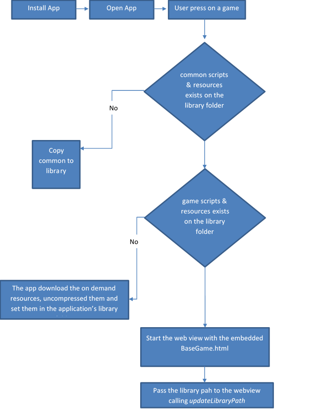

# About
This project is a prof of concept application that shows how we can embed the NG games into the application and download the games' resources on demand

# Screens
The application contains 2 screens
1. Screen #1 MainViewController
the first screen has 3 buttons:
    1. 'Clean App Cache' - pressing this button clean the application's library folder from all the games' resources
    2. 'Queen of Diamond GWT' - pressing this button opens the Queen of Diamond game as a POC for opening a game in GWT technology
    3. 'Wild Time Extra Pixi' - pressing this button opens the Wild Time Extra game as a POC for opening a game in Pixi technology
2. Screen #2 ViewController - 
The second screen holds a UIWebView that load one of the 2 games according to te user's selection

# Folder structure
The folder structure in this project is the correct folder structure and should be kept in MI application

# application sequence


# Loading on demand
Code example, the ``gameID`` is the tag of the resources that you wish to download

````
func downloadGameResources(_ gameID: String)
{
    //DOWNLOAD ON DEMAND
    request = NSBundleResourceRequest(tags:[gameID])
    request.conditionallyBeginAccessingResources { (available) in
        if available{
            // continue your sequence
        }
        else{
            self.accessResources()
        }
    }
}

 func accessResources(){     
         
    self.request.beginAccessingResources { (error:Error!) in
        if error == nil{
            self.continueLoading()                
        }
        else{
            print(error)                
        }
        self.request.endAccessingResources()
    }
}
````

# Open Game
Opening the game is done inside the web view

```
 override func viewDidLoad() {
    super.viewDidLoad()
    
    do{
        guard let htmlPath = Bundle.main.path(forResource: "BaseGame", ofType: "html")
            else{
                return
        }
        let url = URL(fileURLWithPath: htmlPath)
        let content = try String(contentsOfFile: htmlPath)
        myWebView.loadHTMLString(content as String, baseURL: url)
        
    }
    catch{
        print("FileError")
    }
}
```

# Forward library path
Pass the library path to the game so it will know the path to resources + scripts

```
func webViewDidFinishLoad(_ webView: UIWebView) {

   let libraryPath = try! FileManager.default.url(for: .libraryDirectory, in: .userDomainMask, appropriateFor: nil, create: true)   
    myWebView.stringByEvaluatingJavaScript(from: "updateLibraryPath('\(libraryPath.absoluteString)')")  
}
```


