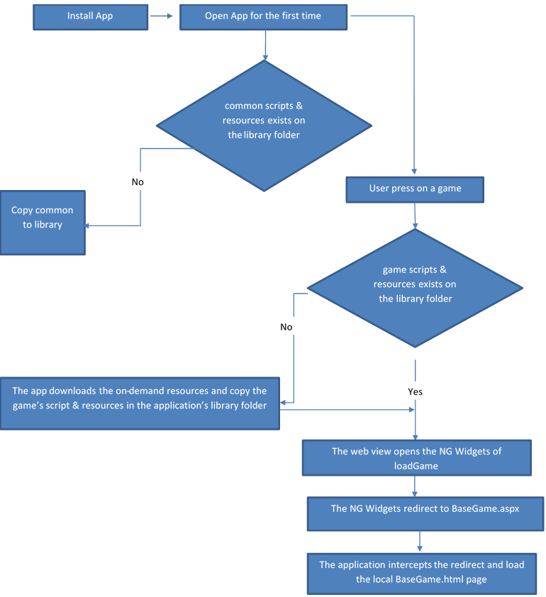

# About
This project is a prof of concept application that shows how we can embed the NG games into the application and download the games' resources on demand

# Screens
The application contains 2 screens
1. Screen #1 MainViewController
the first screen has 3 buttons:
    1. 'Clean App Cache' - pressing this button clean the application's library folder from all the games' resources
    2. 'Queen of Diamond Money' - pressing this button opens the Queen of Diamond game in money mode
2. Screen #2 ViewController - 
The second screen holds a UIWebView that load the game

# Folder structure
The folder structure as presented in this project is the correct structure and should be kept in MI application

# application sequence


# Loading on demand
Code example, the ``gameID`` is the tag of the resources that you wish to download

````
func downloadGameResources(_ gameID: String)
{
    //DOWNLOAD ON DEMAND
    request = NSBundleResourceRequest(tags:[gameID])
    request.conditionallyBeginAccessingResources { (available) in
        if available{
            // continue your sequence
        }
        else{
            self.accessResources()
        }
    }
}

 func accessResources(){     
         
    self.request.beginAccessingResources { (error:Error!) in
        if error == nil{
            self.continueLoading()                
        }
        else{
            print(error)                
        }
        self.request.endAccessingResources()
    }
}
````
# Copy Game resources
Before opening the game all resources should be copied to the 'Libray' folder
This is done by calling ``copyCommonFolder()``, `copyGameScriptFolder()` and `copyGameResources()` functions
The app should use the `GameConfiguration.json` file inorder to detect the correct folders' path for the game's resources & scripts

# Open Game
Opening the game is done inside the web view
First open NG widget's page
```
override func viewDidLoad() {
        super.viewDidLoad()
   
        //open widget page
        let baseUrl = URL(string: "https://qa.gameserver1-mt.com/OP/widgetTest.html?gid=" + gameID + "&gameType=" + gameType)
        webView.loadRequest(URLRequest(url: baseUrl!)   
    }
```
Then catch the web view redirect to BaseGame and load the local BaseGam.html page

```
func webView(_ webView: UIWebView, shouldStartLoadWith request: URLRequest, navigationType: UIWebView.NavigationType) -> Bool {
     
        if(request.url != nil && (request.url?.absoluteString.contains("nggamedomain"))!){
            self.openEmbeddedHTMLPage(request.url?.query ?? "")
            return false
        }
        return true
    }
    
     func openEmbeddedHTMLPage(_ queryStr: String){
        
        do{
            let libraryPath = try! FileManager.default.url(for: .libraryDirectory, in: .userDomainMask, appropriateFor: nil, create: true)
           let url = libraryPath.appendingPathComponent("BaseGame").appendingPathExtension("html")
           let urlWithQuery = URL(string: url.absoluteString + "?" + queryStr)
           // let url = URL(fileURLWithPath: htmlPath)
            let content = try String(contentsOf: url)
            webView.loadHTMLString(content, baseURL: urlWithQuery)
        }
        catch{
            print(error)
        }
    }
```


